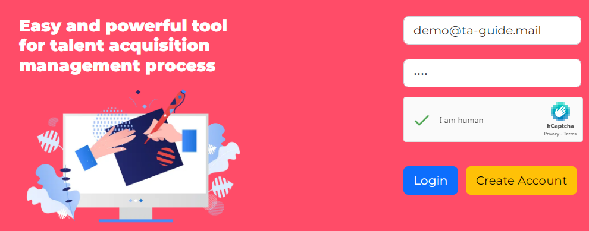
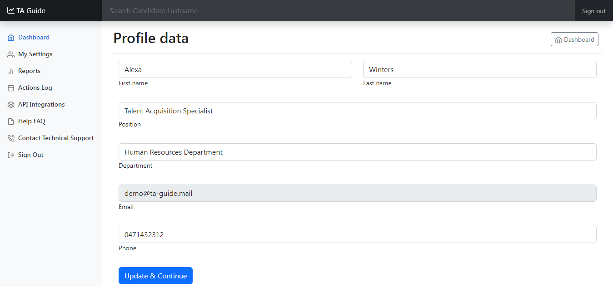
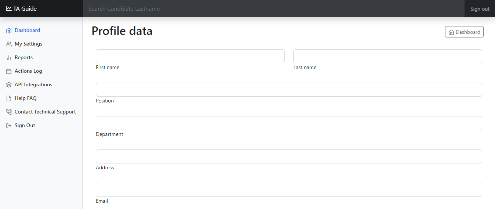
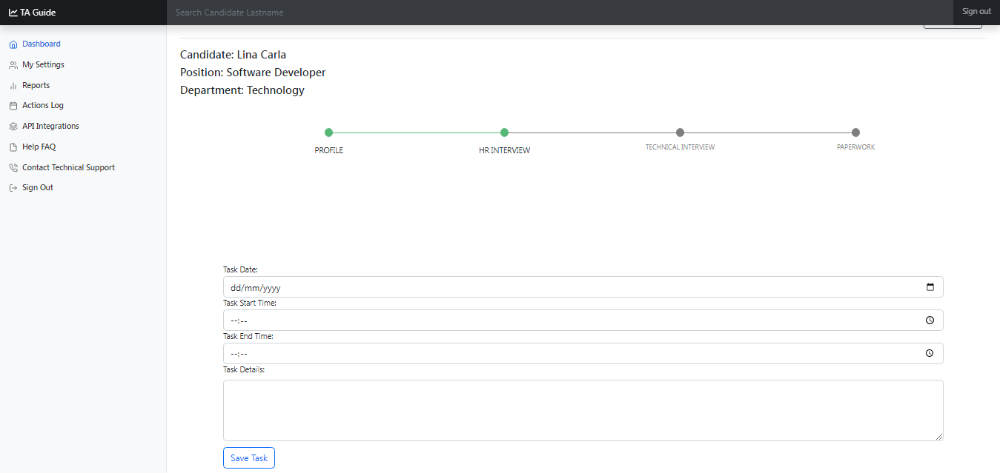
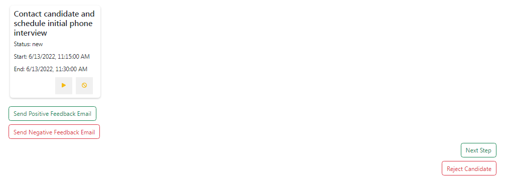
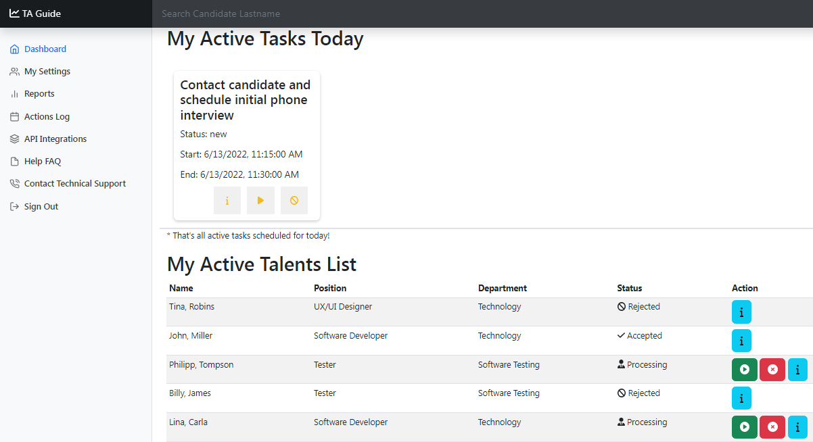
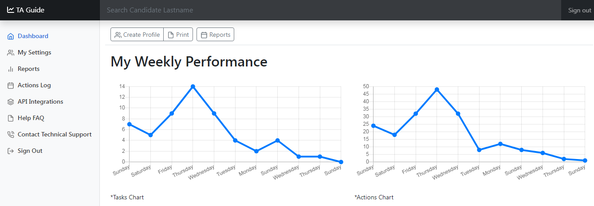
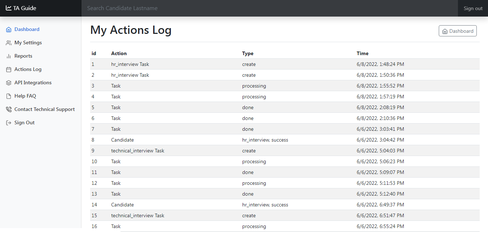
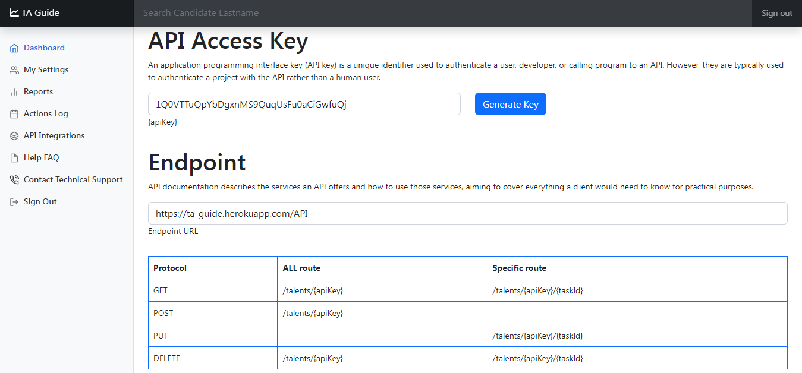

# Talent Acquisition Management System
TA-Guide is powerful and easy to use tool for talent acquisition management process 
- https://ta-guide.herokuapp.com/

# How to use TA-Guide

1. Create your account 
2. Fill in your personal details (My Settings) 
3. Create profile for a new candidate (Create Profile) 
4. Create list of necessary tasks for Initial Human Resources Department Interview 
5. Create list of necessary tasks for Technical Department Interview
6. Create list of necessary tasks for Paperwork Process
7. Track each step of task progress (Mark Task Status as "in progress", "done" or "cancelled") 
8. Send candidate feedback related to each step of recrutment process 
9. Access list of all scheduled tasks for today on Dashboard page 
10. Access performance charts on Dashboard page  
11. Make a final decision of candidte acceptance and send feedback email 
12. Access list of performed actions 
13. REST API 
14. Search by candidate's last name on Dashboard page
15. Finish your working session with Sign out button for security purposes
